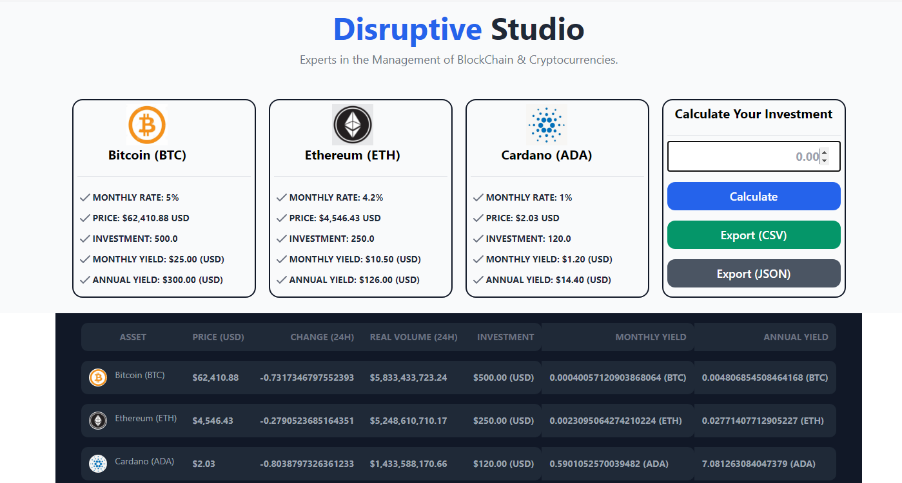

# Cryptochain. Aplicación de ejemplo para la inversión en cryptomonedas

Cryptochain es una aplicación desarrollada en Ruby(3.02) on Rails(7) que consume
datos de la API de Messari con actualizaciones cada 90 segundos y realiza una proyección
de rendimiento mensual y anual de las cantidades que una persona desee invertir en tres
criptomonedas: BITCOIN, ETHEREUM Y CARDANO. Finalmente puede generar archivos en formato
CSV y JSON con la información antes mencionada.

## El presente proyecto es solamente para fines educativos
Las cantidades expresadas en USD es para fines exclusivamente ilustrativos

## Screenshots

    

## Herramientas utilizadas
* Ruby 3.0.2
* Rails 7.0.0.alpha2
* @hotwired/stimulus 3.0.1
* @hotwired/turbo-rails 7.0.1
* Tailwindcss 2.2.19
* Webpack 5.61.0
* rest-client 2.1
* ActionCable
* Minitest
* nvm 0.38.0
* node v16.10.0
* npm 7.24.0

## Requerimientos
Para poder ejecutar esta aplicación se requiere previamente la instalación
de las siguientes herramientas:
* Ruby 3.0.2
* Rails Rails 7.0.0.alpha2
Seguir la guía oficial en: https://gorails.com/setup/ubuntu/20.04 para las
plataformas de Linux.
Para la instalación en windows: https://github.com/railsinstaller/railsinstaller-windows
Finalmente para instalar en Mac: https://gorails.com/setup/osx/11-big-sur

Para la instalación de las herramientas:
nvm 0.38.0 - node v16.10.0 - npm 7.24.0
Seguir la guía de instalación en: https://www.digitalocean.com/community/tutorials/how-to-install-node-js-on-ubuntu-20-04-es

Una vez instalado los requerimientos, hay que clonar el respositorio en una computadora local
de la siguiente forma:
git clone https://github.com/vico116/cryptochain

ingresamos a la carpeta cryptochain con el siguiente comando desde:
cd cryptochain

instalamos las gemas de ruby con la siguiente instrucción:
bundle install

ejecutamos los siguientes comandos:
rails javascript:install:webpack
rails css:install:tailwind
rails hotwire:install
rails turbo:install:redis
rails g heroicon:install

Creamos la base de datos, la cual será creada en MySQL con la siguiente instrucción:
rails db:create

Es importante mencionar que se requieren los datos del usuario y la contraseña del
sistema de gestión de base de datos llamado MySQL, el cual debe ser asignado en el
archivo database.yml que se encuentra ubicado en la carpeta config

Finalmente iniciamos el servidor web en ambiente de desarrollo ejecutando:
./bin/dev

Con el navegador de su elección, pudiendo ser: Chrome, Edge, Mozilla o Safari
intruducimos en la dirección URL lo siguiente:
http://localhost:3000

## Realización de pruebas unitarias
como solo existe un controlador llamado inicio con un solo método llamado index
generamos la prueba unitaria con la herramienta que el Rails trae por default
llamada minitest de la siguiente forma:
rails test

Si el resultado es una pantalla de salida como la siguiente significa
que todo marcha bien:

Running 3 tests in a single process (parallelization threshold is 50)
Run options: --seed 21525

# Running:

...

Finished in 3.515093s, 0.8535 runs/s, 0.8535 assertions/s.
3 runs, 3 assertions, 0 failures, 0 errors, 0 skips

Esta instalación fue probada en una computadora con Ubuntu 20

## Consejos, dudas y sugerencias
Sus comentarios, consejos, dudas  y sugerencias son bienvenidas al correo:
vico116@gmail.com
